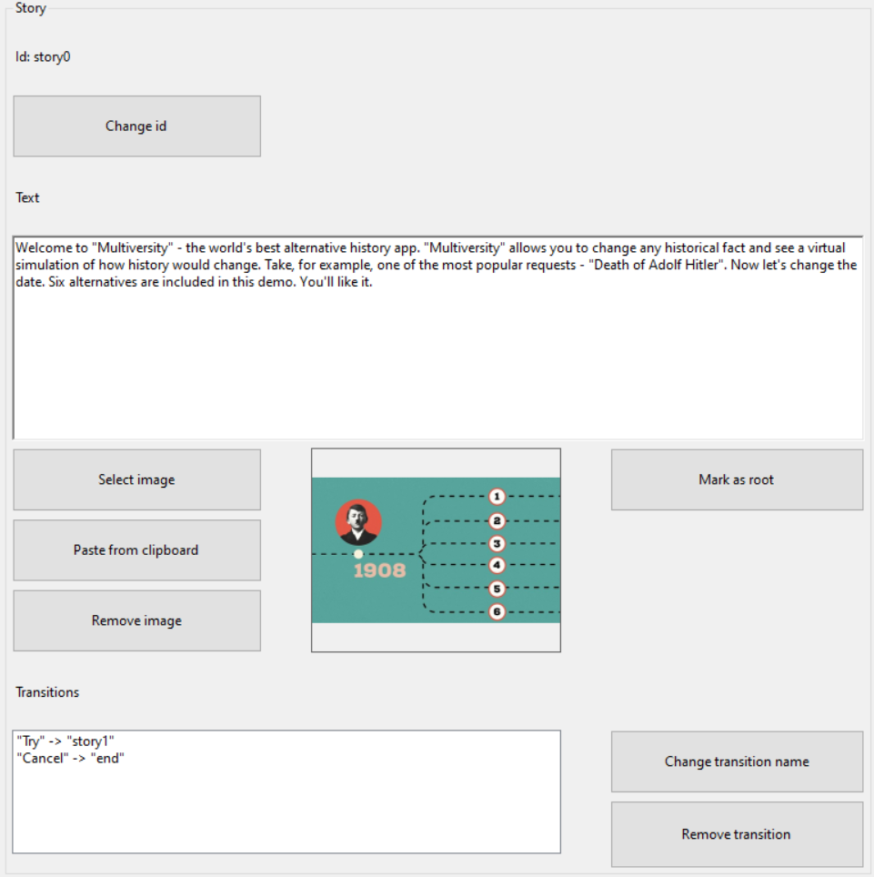

# Storyteller Editor
The Storyteller Editor allows you to create story files (*.story ) for the [Storyteller Bot](https://github.com/Andreyman76/Storyteller-Bot).
## Usage:
There are two areas in the Storyteller Editor: "Graph" and "Story".

The "File" menu contains 3 options: "Save project", "Open project", "Export". The "Save project" and "Open project" options allow you to save and open Storyteller Editor project files (&ast;.stp). The "Export" option allows you to create a story file for the [Storyteller Bot](https://github.com/Andreyman76/Storyteller-Bot) (&ast;.story).

The "Story" menu contains 2 options: "Create new" and "Remove selected". The "Create new" option creates a new story. The "Remove selected" option removes the selected story.

The "Language" menu allows you to select the localization language of the Storyteller Editor (Russian or English). After selecting a language, the application will need to restart.

For example, let's open the project file "Multiversity.stp", based on the 17th episode of the 1st season of the series "Love Death + Robots".

The Graph window displays the IDs of the stories and the transitions between them. The beginning of the arrow indicates which story the transition is from, and the end of the arrow indicates which history the transition is to. The green fill represents the root story (the beginning of the story), in this case "story0".

When you left click on a story from the "Graph" window, the parameters of the selected story will be displayed in the "Story" window. You can edit the id, text, image, transitions of the selected story, and mark the story as root.

You can move stories around the graph by dragging stories with the left mouse button. Right clicking on a story in the "Graph" window allows you to create a transition from the selected story.

Next, you need to right-click on the other story that you want to create a transition to and give the transition a name (the name of the transition will be displayed in the [Storyteller Bot](https://github.com/Andreyman76/Storyteller-Bot) as a transition option).

Rotating the mouse wheel in the "Graph" window allows you to change the font size of the story IDs. Moving the mouse while holding down the mouse wheel in the "Graph" window allows you to move the entire graph.